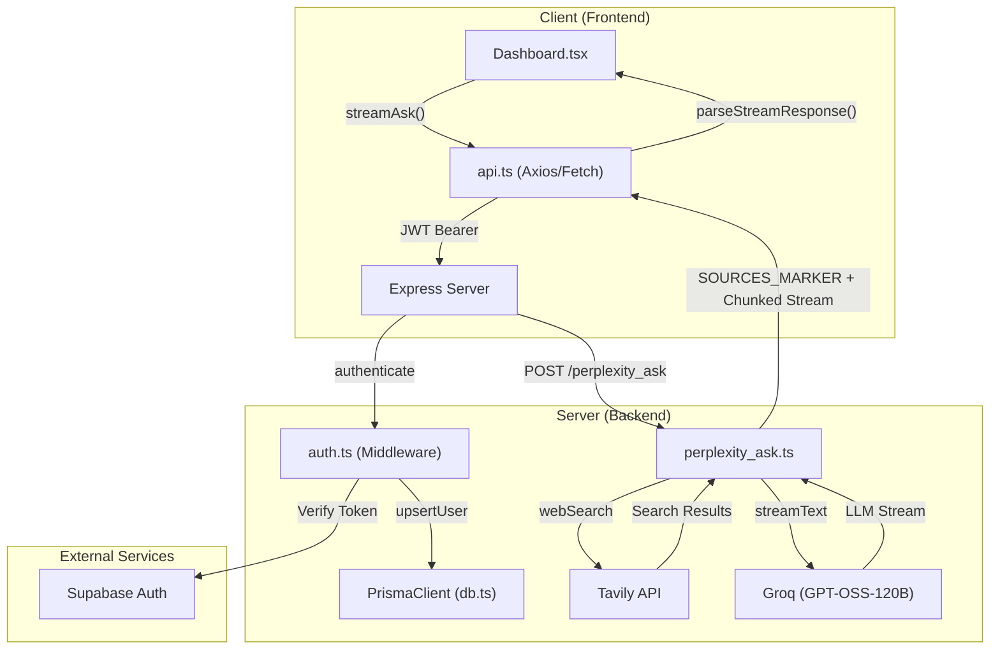

# Perplex

[](https://perplexityclone-frontend-production.up.railway.app/auth)
[](LICENSE)
[](https://bun.sh)
[](https://react.dev)

> An AI-powered search engine that combines real-time web search with large language models to deliver cited, structured answers.

🔗 **[Try it live →](https://perplexityclone-frontend-production.up.railway.app/auth)**

---

## Overview

Perplex is a full-stack Perplexity-inspired search engine. Users submit natural language queries and receive streaming AI responses backed by live web results — each claim traceable to a cited source.

## Features

- **Real-time web search** via Tavily API
- **Streaming AI responses** powered by Groq's GPT-OSS-120B through the Vercel AI SDK
- **Cited sources** for every answer
- **User authentication** via Supabase Auth
- **Persistent chat history** stored in PostgreSQL

## Tech Stack

| Layer | Technologies |
|---|---|
| Runtime | [Bun](https://bun.sh) v1.3.14+ |
| Backend | [Express](https://expressjs.com), [Prisma ORM](https://www.prisma.io), [Zod](https://zod.dev) |
| Frontend | [React 19](https://react.dev), [Tailwind CSS v4](https://tailwindcss.com), [shadcn/ui](https://ui.shadcn.com) |
| AI / Search | [Vercel AI SDK](https://sdk.vercel.ai), [Groq](https://groq.com), [Tavily](https://tavily.com) |
| Database | [PostgreSQL](https://www.postgresql.org) via [Supabase](https://supabase.com) |

## Project Structure

```
.
├── backend/
│   ├── prisma/           # Database schema and migrations
│   ├── routes/           # API route handlers
│   │   └── perplexity_ask.ts
│   └── index.ts          # Express server entry point
└── frontend/
    ├── src/
    │   ├── components/   # React components
    │   └── lib/          # API client and utilities
    └── package.json
```

## Architecture

The system follows a streaming-first architecture where the React frontend communicates with an Express backend via REST API and HTTP streaming.



## Getting Started

### Prerequisites

- [Bun](https://bun.sh) v1.3.14 or later
- A [Supabase](https://supabase.com) project (Auth + PostgreSQL)
- A [Groq](https://groq.com) API key
- A [Tavily](https://tavily.com) API key

### Installation

**1. Clone the repository**

```bash
git clone <repository-url>
cd Perplexity_Clone
```

**2. Install dependencies**

```bash
# Backend
cd backend && bun install

# Frontend
cd ../frontend && bun install
```

**3. Configure environment variables**

Copy `.env.example` to `.env` in the `backend/` directory and fill in your credentials:

```env
DATABASE_URL=your_supabase_postgres_url
SUPABASE_URL=your_supabase_url
SUPABASE_ANON_KEY=your_supabase_anon_key
GROQ_API_KEY=your_groq_api_key
TAVILY_API_KEY=your_tavily_api_key
JWT_SECRET=your_jwt_secret
```

**4. Push the database schema**

```bash
cd backend
bunx prisma db push
```

**5. Start development servers**

```bash
# Terminal 1 — Backend
cd backend && bun dev

# Terminal 2 — Frontend
cd frontend && bun dev
```

The frontend will be available at `http://localhost:3000`.

## Usage

1. Sign in with your Supabase account
2. Enter any question in the search bar
3. Watch the AI stream a cited answer in real time
4. Revisit previous queries from the sidebar history

## Key Modules

| File | Role |
|---|---|
| `backend/routes/perplexity_ask.ts` | Orchestrates Tavily search + Groq LLM streaming |
| `frontend/src/lib/api.ts` | Handles streaming API calls and response parsing |
| `backend/prisma/schema.prisma` | Defines `User` and `Chat` database models |

## License

MIT — see [LICENSE](LICENSE) for details.
